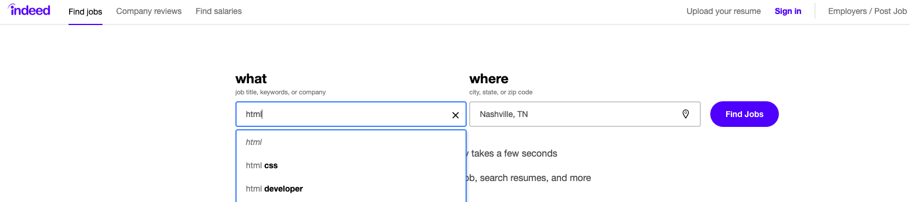

# Career Connection

## Career Connection

Welcome to your first Career Connection! Career Connections will review real-world applications for the material covered. We’ll prepare you to be tested on your new knowledge in technical interviews and suggest strategies to become employer-competitive.

We've consulted many employers to find out what will help you stand out from the crowd. Armed with that knowledge, we'll guide you through steps you can take every week to get there.

### Becoming Employer-Competitive

Here at Career Services, we've come up with two job-preparedness levels: **employer-ready** and **employer-competitive**. Let's look at what these terms mean:

* **Employer-ready** means that you meet the minimum requirements to apply for a developer job. You have strong, complete job search materials (e.g., resume, portfolio, LinkedIn profile). With some luck, an employer might notice you among a stack of applications and decide you fit their needs.

* **Employer-competitive** means that you've given yourself the best chance to secure your desired job. You've put together excellent job search materials, you know how to prepare for interviews, and you use multiple networking strategies to proactively seek and pursue the jobs you want. 

    > **Deep Dive:** To learn more about becoming employer-competitive, see [Intro to Career Services](https://sites.google.com/2u.com/careerservices-webdev/coding-milestones/intro-to-career-services). 

Most of the students who work with Career Services to reach the employer-competitive level find employment within six months after graduation! 

Being employer-competitive means starting now to position yourself as a developer, think like a developer, and engage with the online development community. Ready to get started? Complete the following three steps, and you’ll be that much closer to acing the job interview when the time comes.

#### Step #1: See What's Out There

Peruse open source projects to get a feel for what's out there. Pay attention to what other developers write in their commit messages. You can start by reviewing the following projects on GitHub:

* [ChartJS](https://github.com/chartjs/Chart.js)

* [D3js](https://github.com/d3/d3)

* [Flux](https://github.com/facebook/flux)

#### Step #2: Learn How to Market Yourself

Browse professionally designed websites and apps for inspiration as you prepare to build a portfolio. The following links provide numerous examples of style and layout:

* [10 Fantastic Portfolio Websites from Silicon Valley Design Leads](https://medium.com/@bestfolios/10-fantastic-portfolio-websites-from-silicon-valley-design-leads-2d84b384dba6)

* [One Page Love](https://onepagelove.com/inspiration/portfolio)

* [CodeBurst: 10 Awesome Web Developer Portfolios](https://codeburst.io/10-awesome-web-developer-portfolios-d266b32e6154)

#### Step #3: Code a Lot&mdash;and Put It All on GitHub

Many companies will ask you to pair program with one of their developers during an interview, so practice this skill with a friend or classmate. Also, because GitHub makes it easy for employers to check your commit history, make sure both you and your partner to GitHub commit regularly. And don’t forget to keep your commit messages clean and professional!

Review your own code commit chart periodically to see how you appear to employers. The following image shows an example of a commit chart:

In this chart, each green box represents a time when a commit was made. The darker the green, the more commits that happened. Big gray spaces look bad to prospective employers, while lots of green boxes look awesome.

### Look to the Future

Git, HTML, and CSS are fundamental to any web application you'll develop in the future. You’re already on your way to becoming a junior web developer! Sometime down the road, you might want to climb the ranks to senior developer or principal developer&mdash;or maybe even chief technology officer (CTO).

Senior developers work on complex projects with a variety of technologies and tools. So when you're learning to code, use plenty of tools and methodologies from current real-world projects. 

But it all begins with HTML, CSS, and Git. Though it's unlikely that you'll ever interview directly for an “HTML job," you'll almost definitely face questions about HTML and CSS at some point in the interview process. Start practicing these skills now.

#### Step #1: Investigate Developer Job Listings

[Indeed.com](https://www.indeed.com/) is a great resource for finding a variety of job postings. Visit the website and search for the following three technologies: HTML, CSS, and Git.

The following screenshot shows what that search may look like:

Look through the search results for each category. Then write your answers to the following questions:

* **Where do HTML, CSS, and Git typically appear in the job description?**

    You may find the terms listed with other technologies under a heading like Skills Required, Tech Stack, or something similar. These lists can be intimidating, but think of them as nothing more than wish lists&mdash;most companies know they won’t get everything they want. Don’t be afraid to apply for jobs where you only know 60% or 70% of the required technologies. Employers are also looking for that all-important **cultural fit**, meaning they want someone who will work well with the team. Technical skills can be taught, but cultural fit can't.

* **What other skills are listed alongside HTML, CSS, and Git?**

    Besides HTML, CSS, and Git, you might see JavaScript, object-oriented design, SQL, MongoDB, Bootstrap, Rest, JSON, or React. By the end of this course, you'll possess these skills too. You might see other technologies listed&mdash;such as ASP.NET, Spring, Angular, or VueJS&mdash;that aren't covered in this course. Yet the skills you'll learn transfer directly to these other technologies. They aren't all that different, anyway!

* **What level of experience, in years, are employers typically looking for?**

    You’ll notice that almost all job postings specify at least two to three years of development experience. Those looking for senior developers will call for five to eight years minimum. Again, treat these requests like a wish list. If you see a job posting along the lines of “front-end developer, two years experience,” you can and should apply for that job.

#### Step #2: Add Technical Skills to Your Resume

Before you move on to the next module, make sure to add HTML, CSS, and Git to the Technical Skills list on your resume. This will help you pass those pesky automated resume scanners and will indicate to potential employers that you have the skills they need.

> **Deep Dive:** To learn more about developing your resume, see the resources at [Milestone: Develop Your Resume](https://sites.google.com/2u.com/careerservices-webdev/coding-milestones/milestone-develop-your-resume).

### Prepare for the Technical Interview

Many companies use algorithm questions during the technical interview. We’ll start diving into those when we learn JavaScript. For HTML, CSS, and Git, consider the following common technical interview questions:

* Which browsers support HTML5?

* Which two attributes should every `` tag should have?

* What's the difference between a class selector and an id selector?

* Why is it preferable to use external style sheets instead of inline CSS?

* What are the advantages of using Git?

When you've answered these questions on your own, search the internet to check your answers.

### Career Services Events

To learn more about the technical interviewing process, see [Career Services' upcoming workshops](https://careerservicesonlineevents.splashthat.com/).
